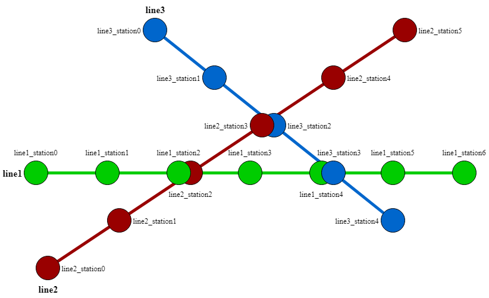
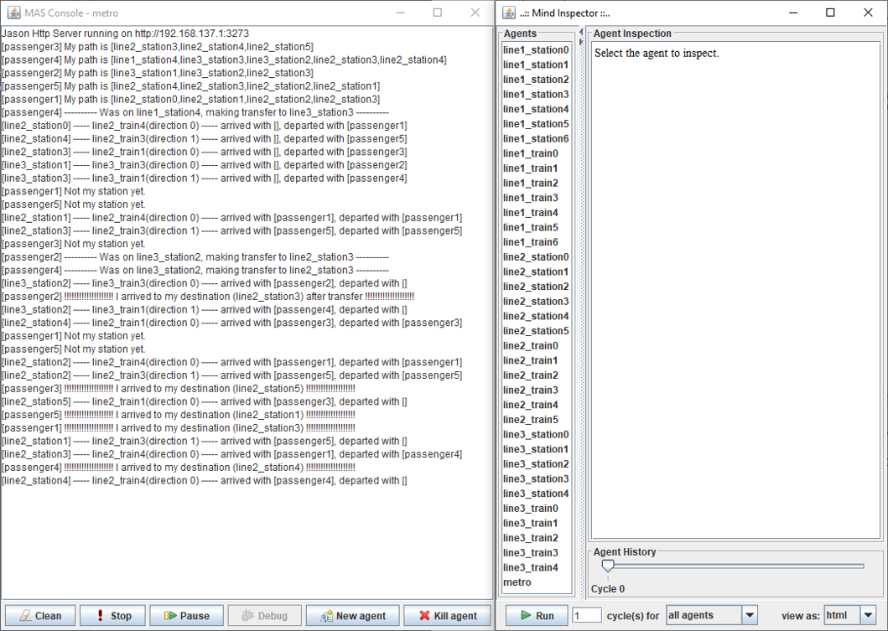

# Мультиагентная система (МАС) метрополитена

## Описание

В данном проекте представляется модель работы гипотетического метрополитена, в котором существуют среда и следующие типы агентов:
- метро;
- поезд;
- станция;
- пассажир.

Сначала среда (файл MetroEnv.java) создает граф с заданным количеством линий метро, заданным количеством станций на каждой линии, а также с пересадками, являющимися пересечением некоторых станций (методы добавления линий, станций и пересадок описаны в файле Metro.java).

 
После создания графа, среда посылает всем созданным на данный момент агентам (метро и пассажиры) информацию о линиях и станциях. Агент-метро (файл metro.asl), получив данную информацию, создает станции и поезда в виде агентов (station.asl и train.asl) и отправляет всем агентам сигнал об открытии метро (убеждение metroIsOpen).

Агенты-поезда (файл train.asl), получив убеждение metroIsOpen, инициализируют свою начальную станцию и начинают движение. 
Агенты-пассажиры (файл passenger.asl), получив убеждение metroIsOpen, инициализируют себе начальную и конечную станцию и запрашивают у среды маршрут пути (путь ищется с помощью Алгоритма Дейкстры, описанного в файлах Dijkstra.java и Node.java). Получив путь, пассажир получает направление и проверяет, находится ли он на станции пересадки – если нет, то он получает направление и ждет прибытия поезда на станцию, иначе делает пересадку и снова проверяет текущую станцию. 

Приехав на агент-станцию (файл station.asl), поезд сообщает агентам-пассажирам, находящихся в данном поезде, о текущей станции. Если текущая станция является для пассажира конечной станцией или станцией, на которой нужно сделать пересадку, то пассажир выходит на данной станции. При этом те пассажиры, которые были на станции, садятся в поезд и поезд едет дальше. Доезжая до последней станции на линии, поезд меняет свое направление и продолжает движение.

Доехав до своей конечной станции, пассажир удаляет себя из мультиагентной системы. Программа считается успешно выполненной, если все пассажиры доехали до своей конечной станции или, иначе говоря, если все пассажиры удалились из системы.

## Установка

Для работы проекта необходим плагин Jason, установка которого подробно описана по следующей ссылке: http://jason.sourceforge.net/mini-tutorial/getting-started/

## Пример работы программы

На рисунке показан пример работы программы с 5-ю пассажирами. Так как все они доехали до своей конечной станции, то в отладчике их не видно – они удалились из мультиагентной системы.